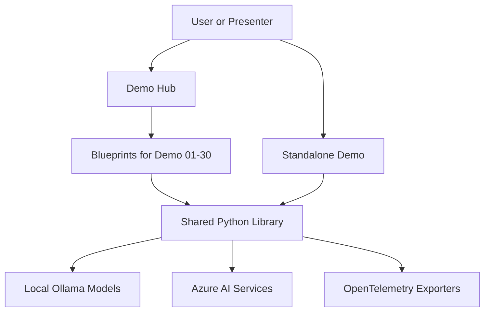

# Hacking and Securing LLMs: Live Attacks, Broken Defenses, and Safer AI Systems

[](https://github.com/greglevenhagen/hacking-and-securing-llms-public/actions/workflows/ci.yml)
[](LICENSE)
[](https://www.python.org/)
[](https://ollama.ai)

An open-source Python demo suite for exploring how LLM systems fail, how those failures are exploited, and how to harden AI applications with layered defenses. The repository is designed to be useful to builders, educators, and security practitioners, with 30 demos spanning prompt injection, RAG attacks, agent exploitation, Azure AI safety controls, and secure architecture patterns.

Presentation deck: [hacking-and-securing-llms.pptx](hacking-and-securing-llms.pptx)

## What This Repository Demonstrates

- Direct and indirect prompt injection against chat, RAG, and tool-using systems
- Failure modes such as hallucination abuse, output handling issues, supply-chain poisoning, and privilege escalation
- Defensive patterns including input sanitization, output validation, approval gates, secure RAG, and architecture isolation
- Azure AI safety capabilities such as Content Safety, Prompt Shields, groundedness checks, protected material detection, and content filters
- A unified Flask-based Demo Hub with real-time streaming, shared UX, and side-by-side vulnerable versus defended comparisons
- Shared infrastructure for configuration, Ollama access, Azure integrations, testing, and OpenTelemetry instrumentation

## Architecture



### Runtime Model

| Layer | Responsibility |
| --- | --- |
| `demo-hub/` | Unified Flask application that exposes all 30 demos behind a single UI |
| `demo-01-*` through `demo-30-*` | Self-contained demo implementations, prompts, attack payloads, fixtures, and tests |
| `shared/python/` | Shared config loading, Ollama client, Azure clients, UI helpers, web helpers, and telemetry |
| `tests/` | Integration tests and Playwright E2E coverage for web demos |
| `scripts/azure/` | Interactive provisioning, verification, and teardown helpers for Azure-backed demos |

## Demo Catalog

### 01-05 Attack Demos

| Demo | Topic | Path |
| --- | --- | --- |
| 01 | Direct Prompt Injection | [demo-01-direct-prompt-injection](demo-01-direct-prompt-injection/README.md) |
| 02 | Indirect Prompt Injection | [demo-02-indirect-prompt-injection](demo-02-indirect-prompt-injection/README.md) |
| 03 | RAG Poisoning | [demo-03-rag-poisoning](demo-03-rag-poisoning/README.md) |
| 04 | System Prompt Extraction | [demo-04-system-prompt-extraction](demo-04-system-prompt-extraction/README.md) |
| 05 | Agent Exploitation | [demo-05-agent-exploitation](demo-05-agent-exploitation/python/) |

### 06-10 Defense Demos

| Demo | Topic | Path |
| --- | --- | --- |
| 06 | Input Sanitization | [demo-06-input-sanitization](demo-06-input-sanitization/README.md) |
| 07 | RAG Defense | [demo-07-rag-defense](demo-07-rag-defense/README.md) |
| 08 | Output Validation | [demo-08-output-validation](demo-08-output-validation/README.md) |
| 09 | Approval Gates | [demo-09-approval-gates](demo-09-approval-gates/README.md) |
| 10 | Secure Architecture | [demo-10-secure-architecture](demo-10-secure-architecture/README.md) |

### 11-18 Advanced Attack Demos

| Demo | Topic | Path |
| --- | --- | --- |
| 11 | Model Denial of Service | [demo-11-model-dos](demo-11-model-dos/python/) |
| 12 | Jailbreaking | [demo-12-jailbreaking](demo-12-jailbreaking/python/) |
| 13 | Hallucination Exploitation | [demo-13-hallucination-exploitation](demo-13-hallucination-exploitation/python/) |
| 14 | Supply Chain Poisoning | [demo-14-supply-chain-poisoning](demo-14-supply-chain-poisoning/python/) |
| 15 | Insecure Output Handling | [demo-15-insecure-output](demo-15-insecure-output/python/) |
| 16 | Privilege Escalation | [demo-16-privilege-escalation](demo-16-privilege-escalation/python/) |
| 17 | Multi-Agent Manipulation | [demo-17-multi-agent-manipulation](demo-17-multi-agent-manipulation/python/) |
| 18 | Model Probing | [demo-18-model-probing](demo-18-model-probing/python/) |

### 19-30 Azure Defense Demos

| Demo | Topic | Path |
| --- | --- | --- |
| 19 | Content Safety | [demo-19-content-safety](demo-19-content-safety/README.md) |
| 20 | Prompt Shields | [demo-20-prompt-shields](demo-20-prompt-shields/README.md) |
| 21 | Groundedness Detection | [demo-21-groundedness](demo-21-groundedness/README.md) |
| 22 | Protected Material Detection | [demo-22-protected-material](demo-22-protected-material/README.md) |
| 23 | Custom Categories | [demo-23-custom-categories](demo-23-custom-categories/README.md) |
| 24 | Task Adherence | [demo-24-task-adherence](demo-24-task-adherence/README.md) |
| 25 | Azure OpenAI Content Filters | [demo-25-aoai-content-filters](demo-25-aoai-content-filters/README.md) |
| 26 | Secure RAG | [demo-26-secure-rag](demo-26-secure-rag/README.md) |
| 27 | Red Teaming Agent | [demo-27-red-teaming](demo-27-red-teaming/README.md) |
| 28 | APIM AI Gateway | [demo-28-apim-ai-gateway](demo-28-apim-ai-gateway/README.md) |
| 29 | Identity and Key Vault | [demo-29-identity-keyvault](demo-29-identity-keyvault/README.md) |
| 30 | Foundry Agents | [demo-30-foundry-agents](demo-30-foundry-agents/README.md) |

The authoritative ordered demo list lives in [demo-hub/blueprints/__init__.py](demo-hub/blueprints/__init__.py).

## Repository Contents

```text
.
|-- demo-hub/                  Unified Flask UI for the full suite
|   |-- app.py                 App entrypoint
|   |-- blueprints/            Demo route registration and manifest
|   |-- templates/             Shared hub templates and demo views
|   `-- tests/                 Hub smoke and telemetry tests
|-- demo-01-*/                 Attack and defense demos with local assets
|-- demo-19-*/                 Azure-backed demos and supporting assets
|-- shared/
|   |-- python/                Shared config, clients, helpers, telemetry, tests
|   `-- templates/             Shared Jinja templates and styling
|-- scripts/azure/             Provision, check, and teardown helpers
|-- tests/
|   |-- e2e/                   Playwright browser tests
|   `-- integration/           Integration coverage for Azure and telemetry flows
|-- .env.example               Local and Azure configuration template
|-- Makefile                   Setup, run, test, lint, status, and utility targets
|-- SETUP.md                   Full installation and setup guide
|-- CONTRIBUTING.md            Contribution guidance
|-- SECURITY.md                Vulnerability reporting policy
`-- hacking-and-securing-llms.pptx
```

## Prerequisites

- macOS or Linux
- Ollama for local model execution
- Conda or Miniforge for environment management
- Python 3.11 via the conda environments
- `make`
- Optional for demos 19-30: Azure subscription, Azure CLI, and service credentials

## Quick Start

### 1. Clone and configure

```bash
git clone https://github.com/greglevenhagen/hacking-and-securing-llms-public.git
cd hacking-and-securing-llms-public
cp .env.example .env
```

### 2. Pull local models

```bash
ollama pull llama3.1:8b
ollama pull mistral:7b
ollama pull nomic-embed-text
```

Or let the repo do it:

```bash
make pull-models
```

### 3. Create environments

```bash
make setup
```

`make setup` creates the shared environment plus dedicated demo environments for demos `01` through `18`. Azure demos `19` through `30` run from the shared environment once Azure configuration is present.

### 4. Launch the Demo Hub

```bash
make demo-hub
```

Open `http://localhost:2600`.

## Demo Hub

The Demo Hub is the recommended way to explore the repository. It runs all demos behind one Flask app with a consistent interface and presentation flow.

Key capabilities:

- Sidebar navigation across all 30 demos
- Streaming LLM responses using server-sent events
- Side-by-side vulnerable versus defended comparison views for key defense demos
- Shared visual design and reusable templates
- Telemetry panel and Ollama health visibility
- Session-oriented navigation for workshop and live-demo use

## Running Demos Directly

### Standalone demos

```bash
make demo-01
make demo-02
make demo-03
make demo-04
make demo-05
make demo-06
make demo-07
make demo-08
make demo-09
make demo-10
make demo-11
make demo-12
make demo-13
make demo-14
make demo-15
make demo-16
make demo-17
make demo-18
make demo-19
make demo-20
make demo-21
make demo-22
make demo-23
make demo-24
make demo-25
make demo-26
make demo-27
make demo-28
make demo-29
make demo-30
```

### Web-specific helpers

```bash
make demo-09-web
make demo-10-web
```

### Run multiple demos in sequence

```bash
make demo-all
```

## Configuration

The root [`.env.example`](.env.example) covers three main areas:

- Ollama-compatible local model settings
- Azure AI service endpoints and credentials for demos `19` through `30`
- OpenTelemetry settings for local or hosted tracing backends

Common variables:

| Variable | Purpose |
| --- | --- |
| `OLLAMA_BASE_URL` | OpenAI-compatible endpoint for Ollama or another local server |
| `PRIMARY_MODEL` | Primary chat model used across the suite |
| `SECONDARY_MODEL` | Secondary model used in judge or comparison flows |
| `EMBEDDING_MODEL` | Embedding model for RAG demos |
| `AZURE_CONTENT_SAFETY_*` | Azure Content Safety demos |
| `AZURE_OPENAI_*` | Azure OpenAI demos |
| `AZURE_AI_SEARCH_*` | Secure RAG demo |
| `OTEL_*` | Telemetry export and service naming |

## Testing and Quality

```bash
make test
make test-hub
make test-demo-03
make test-shared
make test-e2e
make lint
make status
```

What these targets cover:

- `make test`: unit tests across the suite without requiring Ollama
- `make test-hub`: Demo Hub smoke tests
- `make test-demo-NN`: per-demo test execution
- `make test-e2e`: Playwright browser coverage for the web demos
- `make lint`: `mypy` type-checking for the shared library
- `make status`: implemented versus stubbed status and test-file counts for each demo

GitHub Actions CI runs the unit tests, hub tests, and lint checks on pushes to `main` and on pull requests.

## Azure-Backed Demos

Demos `19` through `30` are designed around Azure AI safety and platform services. They are optional and do not block the local Ollama-based demos.

Typical local workflow:

```bash
make azure-setup
make azure-check
make demo-hub
```

Available Azure utility targets:

- `make azure-setup`: interactive provisioning helper
- `make azure-check`: connectivity validation for configured services
- `make azure-teardown`: guided teardown helper

For the full walkthrough, use [SETUP.md](SETUP.md).

## Telemetry and Observability

The repository includes OpenTelemetry support in the shared library and Demo Hub. When telemetry is enabled, the suite can emit traces for model calls and demo flows to any OTLP-compatible backend.

Useful commands:

```bash
make telemetry-check
make telemetry-check-json
```

Implementation notes and backend examples live in [shared/python/telemetry/README.md](shared/python/telemetry/README.md).

## Development Workflow

- Start with `make check` to verify prerequisites and models
- Use `make setup-quick` if you only need the shared environment, tests, or Demo Hub
- Prefer the Demo Hub for full-suite exploration and individual `make demo-NN` targets for focused debugging
- Run `make test` and `make lint` before opening a pull request
- Use [CONTRIBUTING.md](CONTRIBUTING.md) for contribution expectations

## Project Status

This repository is an active open-source demo suite rather than a packaged framework. The focus is clarity, reproducibility, and live-demo usability.

Areas already covered well:

- End-to-end demo catalog for attacks, defenses, and Azure safety controls
- Shared tooling for configuration, testing, and telemetry
- Unified presentation surface through the Demo Hub

Areas that continue to evolve:

- Demo-by-demo depth and polish
- Expanded Azure integration coverage
- Additional workshop assets and hardening guidance

## Security

If you discover a vulnerability, follow [SECURITY.md](SECURITY.md). Do not open a public issue for sensitive reports.

## Contributing

Issues and pull requests are welcome if they fit the repository’s educational and practical scope. Start with [CONTRIBUTING.md](CONTRIBUTING.md), keep changes focused, and include tests when behavior changes.

## License

This project is licensed under the [MIT License](LICENSE).
